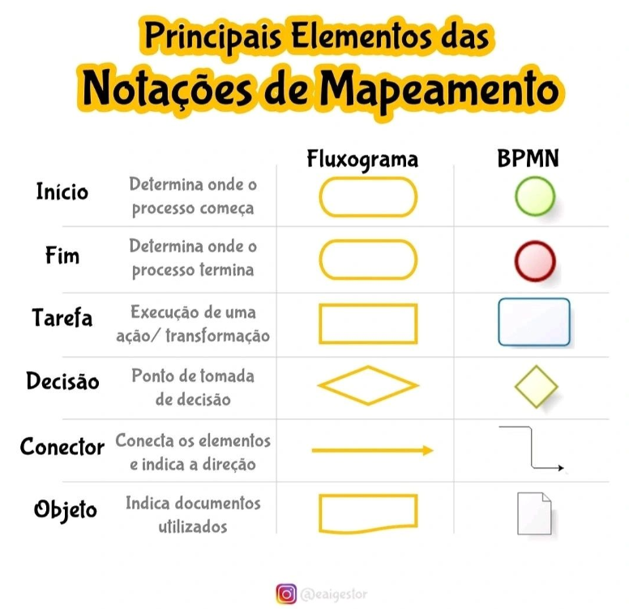
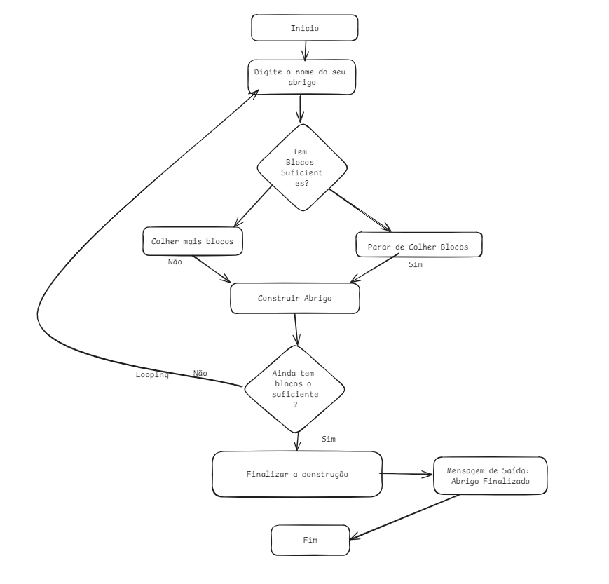

# Formação Lógica de Programação. 

## Onboarding
Curso focado no desenvolvimento de abilidades sólidas para iniciar no mundo da programação antes de qualquer línguagem. São conceitos e bases para aprendizado de lógica de programação.

O curso é ministrado pelo instrutor Felipe Aguiar.

## Materiais Complementares

Mapa de aventra: Material disponivel no notion, para ser utilizado com foco de organização e anotações de um fluxo de aprendizado. 

O foco é entender o conceito e conseguir explicar para outras pessoas

Nos é apresentado o mapa de aventura para seguirmos um reteiro sobre o curso. 

[Mapa de aventura](https://helpful-jump-17b.notion.site/Mapa-de-aventura-91f3e9bd923842149d4dba754dc65c07)


## Introdução a Lógica de Programação

Vale dos conceitos básicos. Primeiro contato com conceitos, todo aprendido aqui é o primeiro conteudo utilizado para criar grandes soluções. 

### Entendendo Algoritimos e Fluxogramas

Para que serve lógica? Orgnizar instruções, pensamentos para sequencias de ações
Para quem é o conteudo? Para todo mundo. Pois utilizamos e necessitamos de lógca em todo que é feito. 

A linguagem de programação é a sintaxe. A ação é a logica. 

Antes de escrevermos instruções ao computador, necessitamos saber quais as instruções que preciamos descrever e fazemos isto na forma de algoritimos. 

Algoritimos? Passo a passo lógido do que se tem que executar para resolver um problema. Ordem de ações para resolver um determinado problema.

Exercicios de fixação: 

    - Inicio:
        - Assar um pão:
            - Abrir o forno
            - O forno está acesso? 
                - Sim? Botar Lenha
                - Não? Acender fogo
            - Assar o pão
    - Fim

    - Inicio:
        - Fazer uma ligação
            - Celular está carregado?
                - Sim? Ligar, fim do programa.
                - Não? Pegar carregador
            - Ligar carregador na tomada
            - Esperar carregar
            - Ligar telefone
            - Fazer ligação
    - Fim
    
Fluxogramas: Representação visual de sequencias lógica ou pensamento lógico. 


Desafio: Criar um abrigo para os heróios se protegerem dos monstros.



### Estrutura de um Software e seu Ambiente de Desenvolvimento

#### input - Process - Output
Como construimos um aplicativo? Como um aplicativo funciona?

- Comandos de entrada: 
    - Procurar um pedido
    - Solicita um pedido

- Comandos de processamento: 
    - Verifica se o pagamento foi aprovado
    - Verificar se o restaurante está aberto
    - Começa o preparo do seu pedido

- Comandos de saída:
    - Seu pedido está sendo levado até você

Três pilares que toda aplicação.
- Comandos: 
    - Input: Momentos de interação com o usuário
    - Process: São verificações e ções para realizar o pedido do usuário
    - Output: Comandos de saída, para retornar alguma coisa ou dar algum posicionamento ou mensagem para o usuário

Uma aplicação tem vários destes momentos, input, output ou processamento.

Exemplo de processo de cancelamento:
- Input: Clicar solicitar cancelamento
- process: Verificar se o pedido está atrasado
            Verifica se precisa pagar alguma multa
- Output: Pedido Cancelado

Desenvolver uma missão macro de um aplicativo para viagens de veículos online:
- Funcionalidades (Features):
    - Solicitar veículo
    - Cadastrar usário
    - Cadastrar motorista

Feature Cadastrar usuário:
- Input: 
    - clicar no botão "cadastrar novo usuário"
    - digitar na tela tela nome e cartão de crédito
- Process
    - Verificar CPF se possui irreguralidades
    - Verifiar se cartão de crédito é disponível (O classico 1 real no cadastro de cartões)
- Output
    - Mensagem de saída: "Usuário cadastrado com uscesso"

Feature Cadastrar veículo:
- Input: 
    - clicar no botão "Solicitar nova viagem".
    - colocar ponto de partida e destino.
- Process
    - Verificar motoristas ais pertos da região.
    - Acionar o motorista mais perto.
    - colocar no GPS do motorista o ponto do passageiro.
- Output
    - Mensagem de saída: "Seu motorista está indo até você"
    - Atualizar tela com tempo de estimativa de chegada do motorista

Feature Cadastrar Motorista:
- Input: 
    - clicar no botão "Solicitar novo cadastro".
    - colocar dados de placa de carro, nome e cpf.
- Process
    - Verificar CPF se possui irregularidades.
    - verificar placa do carro se possui irreagularidades.        
- Output
    - Mensagem de saída: "Motorista cadastrado com sucesso".
    - Atualizar cor de fundo

Cada algoritimo tem seu momento de input, proessamento e ouput. 

#### Primeiro ambiente de código

IDE: Ambiente de desenvolvimento integrado
    Sugestão de IDE:
        - [PlayCode](https://playcode.io/javascript)

Por que java Script e não portuguol? 
    - Curva de aprendizagem mais rápida. 
    - Já somos inseridos dentro do conceito de lógica com uma lingaguem de programação. 
    - Ganho de tempo.

Torne a sua IDE o seu aliado. 

Dica de programação:
    - Faça o caminho diferente para aprender a lidar com situações adversas.
    - Desenvolvedor, uma pessoa especialista em identificar problemas.
    - Divirta-se drante sua jornada. 
    - Tornar o ambiente de desenvolvimento mais agradavel.

### Trabalhanco com váriaveis

#### Variaveis e constants pra que te quero

Vamos aprender tudo que são variáveis, tipos de dados e ademais conceitos. 

Situação hipotética: Abrimos um jogo e é nos pedido o nome de personagem. Posterio o nome do personágem é lembrado para sempre. Isto é uma variável.

Variaveis tem este nome, pq podemos mudar o valor que a mesma possui.

Pote de biscoitos, o pote é o mesmo e o sabor de biscoito pode variar com o tempo. 

Vamos utilizar o PlayCode com javaScript para aprender variáveis. 

[PlayCode](https://playcode.io/javascript)

Declarando Variavéis na Prática: 

Problema Hipotético: Gravando o nome no jogo Pokemon GO

```js
// Escrever algo em tela
console.log('Digite o nome do seu jogador? ');

// Declaracao Variavel com aribuição fixa
let nickname = 'Maria mestra do pikachu';

// Escrever algo em tela com concatenação de mensagem fixa
console.log('Bem vindo ' + nickname);    
console.log(nickname + ' entrou no servidor');    
```

Diferença de váriaveis e Constantes:

Constaone é um valor que não vai mudar.
Variavel como o próprio nome diz é um valor variavel, que precisa se alterar.
```js
const notificacao = 'Pokemon Go diz:';
console.log(notificacao + ' tem um novo pokemon na região.');
console.log(notificacao + ' você foi derrotado por um líder.');
```

Problema da vovó:

Problema: a vóvó tem 3 potes, um de açucar, café e biscoito e queremos saber todo o dia qual o tipo de dado que tem dentro de cada um deles. .

```js
let poteCafe = 'Café pilão';
let poteAcucar = 'Açucar cristal';
let poteBiscoito = 'Biscoito Maizena';
const menssagemDaVovo = "Na cozinha da vovó tem: "

console.log(
   menssagemDaVovo +
    poteCafe +
    ' - ' +
    poteAcucar +
    ' - ' +
    poteBiscoito
);

poteCafe = 'Café 3 corações';

console.log(
  'Na cozinha da vovó hoje tem: ' +
    poteCafe +
    ' - ' +
    poteAcucar +
    ' - ' +
    poteBiscoito
);

```

### Tipos de Variáveis

Typagens de variaveis

Como no mundo real, cada pote tem que guardar o seu conteudo. 

Principais tipos de variaveis: 

```JS
// Representando uma tela com diversos pokemons em um jogo

//pokemon
// string: armazena textos
let nomePokemon = "pikachu"
let pokemonSexo = "M"

// number: armazena numeros
let nivelPokemon = 20
let pontosDeVidaPokemon = 45

// boleana: guarda verdadeiro ou falso, são variáveis lógicas
let selecionavel = true
```

Mais variaveis: 

| Tipo de Variável             | Descrição                                             |
|------------------------------|-------------------------------------------------------|
| **Variáveis numéricas**       | São usadas para armazenar valores numéricos.          |
| **Inteiro**                   | Armazena números inteiros, como 1, 10, -5.            |
| **Ponto flutuante ou decimal**| Armazena números com casas decimais, como 3.14, -0.5. |
| **Números complexos**         | Armazena números complexos, como 2+3j.                |
| **Variáveis de texto**        | Usadas para armazenar sequências de caracteres.       |
| **String**                    | Armazena uma sequência de caracteres, como "Olá, mundo!" |
| **Caractere**                 | Armazena um único caractere, como 'a', 'X', '@'.      |
| **Variáveis lógicas**         | Usadas para armazenar valores de verdadeiro ou falso. |
| **Booleano**                  | Armazena os valores True ou False.                    |
| **Variáveis de data e hora**  | Utilizadas para representar datas e horários.         |
| **Data**                      | Armazena datas, no formato AAAA-MM-DD.                |
| **Hora**                      | Armazena horários, no formato HH:MM:SS.               |

Probelma:

- Registrar alguns dados da vovó em um programa:
````js
// nome, idade, numero de telefone, cpf, endereço, recebe pensão
// string = armazenar texto
// number = armazenar numeros
// boolean = armazenar valores lógicos
// qualquer numero que não vá fazer operações matematicas, armazene como texto. 
// nome de variavies nao vai acent.
// Nao colocar numero nos nomes de váriaveis

let nomePessoa = "Joiscreide Do Pythinho"
let idade = 115
let numeroTelefone = "11-984713388"
let cpf = "312.122.123-45"
let endereco = "Rua dos limoeiros, bairro tal, numero tal"
let recebePensao = true
````

Dicas super importantes na criação de variáveis:
- Qualquer numero que não vá fazer operações matematicas, armazene como texto (Não cravado em pedra). 
- Nome de variavies nao vai acento.
- Nao colocar numero nos nomes de váriaveis.

### Comparando com outras linguagens

Exemplo do código em diferentes linguagens:

- Java: 
````java
public class CozinhaVovo {
    public static void main(String[] args) {
        String poteCafe = "Café pilão";
        String poteAcucar = "Açúcar cristal";
        String poteBiscoito = "Biscoito Maizena";
        final String mensagemDaVovo = "Na cozinha da vovó tem: ";

        System.out.println(
            mensagemDaVovo +
            poteCafe +
            " - " +
            poteAcucar +
            " - " +
            poteBiscoito
        );

        poteCafe = "Café 3 corações";

        System.out.println(
            "Na cozinha da vovó hoje tem: " +
            poteCafe +
            " - " +
            poteAcucar +
            " - " +
            poteBiscoito
        );
    }
}
````

- Pthon:
````python
pote_cafe = "Café pilão"
pote_acucar = "Açúcar cristal"
pote_biscoito = "Biscoito Maizena"
mensagem_da_vovo = "Na cozinha da vovó tem: "

print(
    mensagem_da_vovo +
    pote_cafe +
    " - " +
    pote_acucar +
    " - " +
    pote_biscoito
)

pote_cafe = "Café 3 corações"

print(
    "Na cozinha da vovó hoje tem: " +
    pote_cafe +
    " - " +
    pote_acucar +
    " - " +
    pote_biscoito
)
````

- C#
````C#
using System;

class CozinhaVovo {
    static void Main(string[] args) {
        string poteCafe = "Café pilão";
        string poteAcucar = "Açúcar cristal";
        string poteBiscoito = "Biscoito Maizena";
        const string mensagemDaVovo = "Na cozinha da vovó tem: ";

        Console.WriteLine(
            mensagemDaVovo +
            poteCafe +
            " - " +
            poteAcucar +
            " - " +
            poteBiscoito
        );

        poteCafe = "Café 3 corações";

        Console.WriteLine(
            "Na cozinha da vovó hoje tem: " +
            poteCafe +
            " - " +
            poteAcucar +
            " - " +
            poteBiscoito
        );
    }
}
````

### Criando e Manitpulando Vetores e Matrizes

#### Caixa e Armários

Exemplo hipotético Guardar varios pokemons e uma unica variável. Imagine guardar 150 pokemons em 150 variaveis, isto fica inviável.

- Para isto utilizamos uma especie de armário ou um vetor.
````js
let pokemon = ["Pikachu", "Charmander", "Bulbasaur"]
console.log(pokemon)
````

- Mostrar todos os valores.
````js
let pokemon = ["Pikachu", "Charmander", "Bulbasaur"]
console.log(pokemon[0])
console.log(pokemon[1])
console.log(pokemon[2])
````

- Exemplo de movimenação de vetores
````js
let pokemon = ['Pikachu', 'Charmander', 'Bulbasaur'];

// remove o ultimo elemento de um array
pokemon.pop();

// remove o primeiro elemento de um array
pokemon.shift();

console.log(pokemon[0]);
console.log(pokemon[1]);
console.log(pokemon[2]);
````

#### Comparando vertores com outras linguagens

- java
````java
import java.util.ArrayList;

public class PokemonArray {
    public static void main(String[] args) {
        ArrayList<String> pokemon = new ArrayList<>();
        pokemon.add("Pikachu");
        pokemon.add("Charmander");
        pokemon.add("Bulbasaur");

        // Remove o último elemento do array
        pokemon.remove(pokemon.size() - 1);

        // Remove o primeiro elemento do array
        pokemon.remove(0);

        // Exibe os elementos restantes
        System.out.println(pokemon.size() > 0 ? pokemon.get(0) : null);
        System.out.println(pokemon.size() > 1 ? pokemon.get(1) : null);
        System.out.println(pokemon.size() > 2 ? pokemon.get(2) : null);
    }
}
````

- python
````py
pokemon = ['Pikachu', 'Charmander', 'Bulbasaur']

# Remove o último elemento da lista
pokemon.pop()

# Remove o primeiro elemento da lista
pokemon.pop(0)

# Exibe os elementos restantes
print(pokemon[0] if len(pokemon) > 0 else None)
print(pokemon[1] if len(pokemon) > 1 else None)
print(pokemon[2] if len(pokemon) > 2 else None)
````

- C#
````C#
using System;
using System.Collections.Generic;

class PokemonArray {
    static void Main(string[] args) {
        List<string> pokemon = new List<string> { "Pikachu", "Charmander", "Bulbasaur" };

        // Remove o último elemento da lista
        pokemon.RemoveAt(pokemon.Count - 1);

        // Remove o primeiro elemento da lista
        pokemon.RemoveAt(0);

        // Exibe os elementos restantes
        Console.WriteLine(pokemon.Count > 0 ? pokemon[0] : null);
        Console.WriteLine(pokemon.Count > 1 ? pokemon[1] : null);
        Console.WriteLine(pokemon.Count > 2 ? pokemon[2] : null);
    }
}
````

- Dica: guardar sempre as mesmas cosias nos mesmos armários
    - Alimentos: Arroz, feijão, massa
    - Limpeza: Omo, agua sanitária, alcool

#### Matrizes para que te quero

Matrizes no exemplo de pokemon, podemos usar uma matriz bidimencional, para guardaro o pokemon e seus dados.

````js
let pokemon = ['Pikachu', 'Charmander', 'Bulbasaur'];
let timePokemon = [
  ['Pikachu', 'M', 1],
  ['Charmander', 'F', 3]
]
console.log("O pokmeon " + timePokemon[1][0] + " é do sexo " + timePokemon[1][1] + " e está no nível " + timePokemon[1][2] +".")
````

Conceitualmente como a mastriz funciona com suas posições: 

| Linha | 0         | 1    | 2     |
|-------|-----------|------|-------|
| 0     | Pikachu   | M    | 1     |
| 1     | Charmander| F    | 3     |

Metodos: Ações possiveis, para diversos fatores (Vetores, Matrizes e etc... )
Propriedades: Caracteristicas, fatos e inforamções de diversos fatores(vetores, matrizes e etc...) 

### Encerramento do módulo.

Com os conceitos aprendidos, conseguimos planejar e programar nossos primeiros algoritimos. 